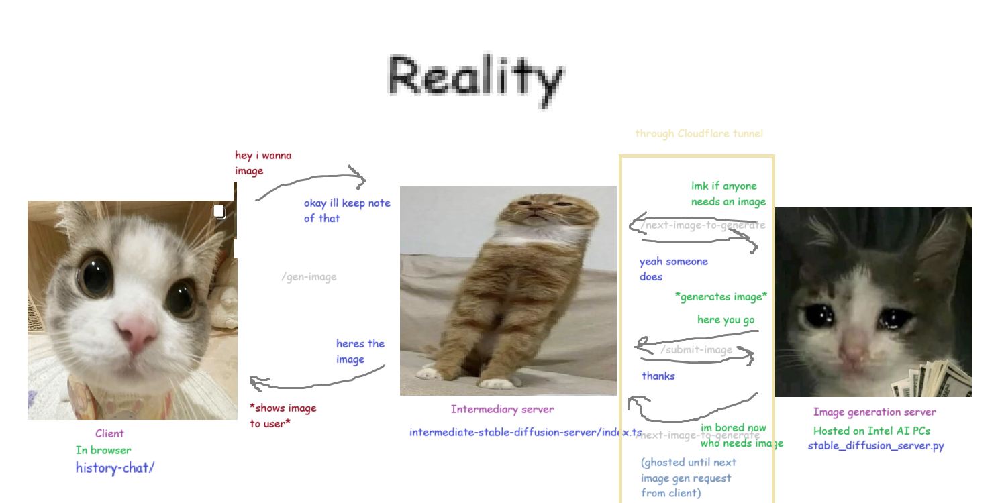

# acm-ai-at-ucb

## Hume example

you need to install node

copy `empathy/.env.example` to `empathy/.env`, then go to https://beta.hume.ai/settings/keys and fill in your `empathy/.env` file

then run these commands:

```shell
$ cd empathy
$ npm install
$ npm run dev
http://0.0.0.0:8000/
```

Open http://0.0.0.0:8000/ in the browser and open the console.

## Intermediary server

```shell
$ cd intermediate-stable-diffusion-server
$ npm install
$ npm start
Example app listening http://localhost:3000
```

In another tab, run this. You will need to install [`cloudflared`](https://developers.cloudflare.com/cloudflare-one/connections/connect-networks/do-more-with-tunnels/trycloudflare/) for their anonymous tunnels.

```shell
$ cloudflared tunnel --url http://localhost:3000
```

This will produce a URL.

On Intel's Jupyter notebook training, select **Pytorch GPU** as the kernel, and install this extra dependency.

```shell
$ /opt/intel/oneapi/intelpython/envs/pytorch-gpu/bin/python -m pip install requests openai --user > /dev/null 2>&1
```

Finally, start the Intel server that generates the Stable Diffusion images.

```shell
$ SERVER=https://ch-aqua-asian-paradise.trycloudflare.com/ /opt/intel/oneapi/intelpython/envs/pytorch-gpu/bin/python Training/AI/GenAI/stable_diffusion_server.py
```

### Design

Ideally, the Stable Diffusion server should just be able to take image generation requests from the client and respond with the generated image.


Unfortunately, Intel Developer Cloud's compute instances [cannot be used as web servers](https://www.intel.com/content/www/us/en/support/articles/000095310/software/software-services.html), and they instead [recommend using ngrok](https://hackpack.readthedocs.io/en/latest/develop_deploy.html#exposing-your-application-via-ngrok).

Because we did not want to set up the same environment from the Jupyter Notebook on the compute instance, we opted to use the Jupyter Notebooks as the server, which did not seem to require or use credits.

However, using ngrok was not possible on the Jupyter Notebooks. There is no superuser access, and using the `ngrok` executable in the home directory makes it delete itself. Cloudflare Tunnels also don't seem to work, seemingly because it relies on the QUIC protocol, which [requires certain ports to be open](https://www.reddit.com/r/CloudFlare/comments/10r6bus/unraid_cloudflare_tunneling_connection_terminated/).

Therefore, if outsiders cannot communicate with the Jupyter Notebook, we must invert the direction of control. The image generation server needs to act like a client. Since it still has internet access, we can have both the user-facing client and the image generation server interface through an intermediary server:



While the client waits on its one request, the intermediary is busy dealing requests from the image generation server. The server is continuously asking for the next available image, and when it gets a prompt, it'll generate the image, then send it back to the server in another request.

The server needs to keep track of waiting requests, which unfortunately can easily get out of sync when clients unexpectedly close their connection, or when the image generation server claims a prompt then promptly dies.
